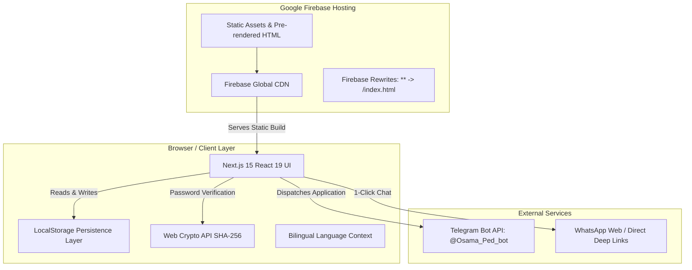

# 🏛️ Architecture & System Design

This document describes the high-level architecture, design decisions, and data flows of the **Dr. Osama AlOudat Mentorship Platform**. It is intended for software engineers and AI agents maintaining, extending, or refactoring this codebase.

---

## 1. Architectural Overview

---

## 2. Core Architectural Decisions

### A. Static Export (`output: 'export'`)
- **Rationale**: The platform is compiled into pure static HTML, CSS, and JavaScript using Next.js 15 static export (`next.config.ts`).
- **Benefits**:
  - Hosted directly on Firebase Hosting without requiring a Node.js server or Cloud Functions.
  - Zero server maintenance, zero cold starts, and near-instant load times worldwide via CDN.
  - Maximum security posture (no server-side code execution vulnerabilities).

### B. In-Page Lightbox Modal Pattern vs. Dynamic Server Routing
- **Challenge**: On static hosting, routes like `/articles/[slug]` only exist for slugs pre-rendered at build time. When Dr. Osama creates a new article in the Admin Panel at runtime, it cannot have a pre-rendered static HTML file.
- **Solution (`ArticleModal.tsx`)**:
  - Instead of navigating away to `/articles/[slug]`, clicking an article card triggers an in-page reading lightbox modal.
  - **Live Markdown Parsing**: The modal parses markdown headings, lists, bold text, and paragraphs on the client side.
  - **Seamless UX**: Zero page reloads, zero 404/redirect errors on Firebase Hosting, and the visitor remains in the context of the landing page or articles hub.

---

## 3. Data Flow & Persistence Architecture

All dynamic content and state reside in the browser via [`src/lib/storage.ts`](./src/lib/storage.ts).

### Storage Keys & Schemas

| Key | Type | Description |
|---|---|---|
| `osama_mentorship_applications` | `ApplicationSubmission[]` | Mentorship inquiries with applicant name, phone, email, track, stage, and target date. |
| `osama_mentorship_testimonials` | `Testimonial[]` | Student reviews with score badges and optional proof screenshot URLs. |
| `osama_mentorship_articles` | `Article[]` | High-yield medical guides and study strategy articles. |
| `osama_mentorship_publications` | `Publication[]` | Dr. Osama's peer-reviewed research papers. |
| `osama_site_settings` | `SiteSettings` | Contact email, WhatsApp number, Instagram link, Telegram Bot Token, and Chat ID. |
| `osama_admin_password_hash` | `string` | Salted SHA-256 hash of the admin password. |
| `osama_admin_auth_session` | `string` | Timestamp of the last authenticated admin activity. |
| `osama_admin_failed_attempts` | `number` | Counter for consecutive failed login attempts. |
| `osama_admin_lockout` | `string` | Timestamp until which admin login is locked out. |

### Fallback Hierarchy
When `localStorage` is empty or the application is loaded for the first time:
1. `storage.getArticles()` falls back to `ARTICLES` in [`src/data/content.ts`](./src/data/content.ts).
2. `storage.getTestimonials()` falls back to `TESTIMONIALS` in [`src/data/content.ts`](./src/data/content.ts).
3. `storage.getSettings()` falls back to `DEFAULT_SETTINGS` in [`src/lib/storage.ts`](./src/lib/storage.ts).
4. `storage.getPublications()` falls back to `DEFAULT_PUBLICATIONS`.

---

## 4. Security & Cryptographic Model

### Password Protection
- **No Plaintext Passwords**: Admin passwords are never stored in plaintext.
- **Hashing**: Uses the browser's native `window.crypto.subtle.digest('SHA-256', ...)` with a private cryptographic salt (`PASSWORD_SALT`).
- **Initial Password**: `osama2026` (hashed to `ed970cbd0a2a7b55b2d87a2f71f4f94e09396f004e26e34e9c36b7826666d11d`).

### Brute-Force Rate Limiting
- Tracked via `osama_admin_failed_attempts`.
- Upon 5 consecutive incorrect password submissions, an automatic 30-second lockout is activated (`osama_admin_lockout`).
- The login form renders a live countdown timer and disables password submission until the lockout expires.

### Inactivity Session Management
- Successful authentication writes the current timestamp to `osama_admin_auth_session`.
- On every protected admin action or page refresh, the session age is evaluated:
  - If `Date.now() - sessionTime < 30 minutes`, access is granted and the session timestamp is refreshed.
  - If `Date.now() - sessionTime >= 30 minutes`, the session is expired and the user is prompted to re-authenticate.

---

## 5. External Integrations

### A. Telegram Bot Real-Time Alerts
- When a student completes the 3-step application in [`ApplyModal.tsx`](./src/components/ApplyModal.tsx):
  1. The application record is stored in `localStorage`.
  2. An asynchronous HTTP POST is dispatched directly to `https://api.telegram.org/bot<TOKEN>/sendMessage`.
  3. The message is formatted in Telegram Markdown containing:
     - Applicant Name
     - Program Track
     - WhatsApp Number (sanitized)
     - Email Address
     - Current Training Stage
     - Target Exam Date
- Both `telegramBotToken` and `telegramChatId` can be updated dynamically in the Admin Settings tab without code changes.

### B. WhatsApp Quick-Contact Integration
- The floating widget ([`WhatsAppWidget.tsx`](./src/components/WhatsAppWidget.tsx)) renders an authentic WhatsApp green pill.
- Scroll-activation: An `IntersectionObserver` or scroll listener reveals the widget only when the user reaches `#articles` (High-Yield Guides), ensuring visitors engage with Dr. Osama's credentials first.
- Admin Panel includes 1-click WhatsApp deep links (`https://wa.me/<NUMBER>?text=...`) for every applicant.

---

## 6. Internationalization (Bilingual System)

- **Language Context (`src/context/LanguageContext.tsx`)**:
  - Provides `language` (`'en'` | `'ar'`), `isAr` boolean, and `toggleLanguage()` helper.
  - Exposes the translation helper: `t(englishText, arabicText)`.
  - Automatically manages document direction: `<html dir="ltr">` for English, `<html dir="rtl">` for Arabic.
  - All components use logical Tailwind spacing (`rtl:right-auto rtl:left-4`, `rtl:pr-4 rtl:pl-10`) to ensure pixel-perfect mirroring.
